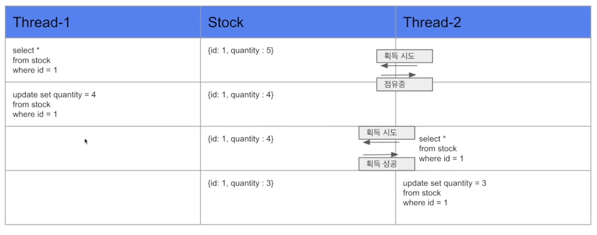
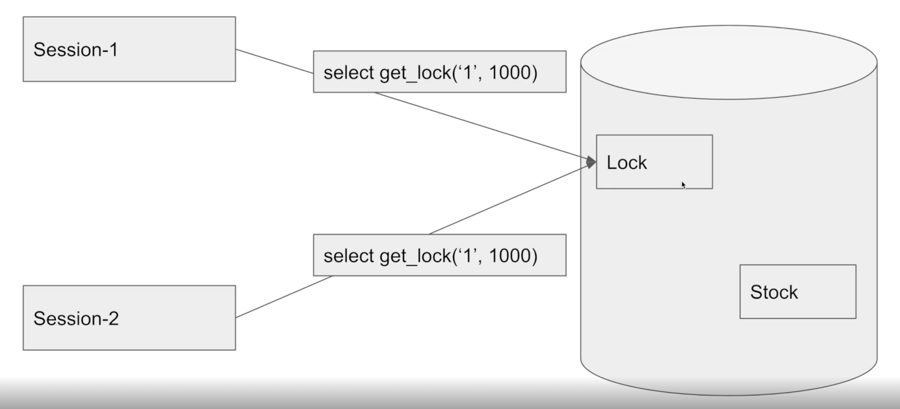
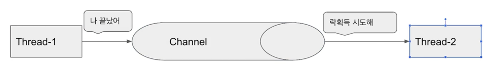

# 재고 시스템으로 알아보는 동시성 이슈 해결방법

## 동시성 이슈

> 재고량을 감소시키는 메소드를 여러 스레드(요청)에서 동시에 접근하게 된다면?
- 재고량 감소 = select + decrease + update
- 한 스레드가 select 하고 update 하기 전, 다른 스레드에서 select 를 하게 되어 동시성 문제 발생

## Synchronized 방법
- 메소드에 `synchronized` 키워드
- 한 스레드의 요청이 끝날 때까지 다른 스레드를 대기시킴
### @Transactional 어노테이션과 함께 쓰지 못함
- 다만, 메소드나 클래스에 Spring `@Transactional` 어노테이션이 선언되었다면, 또다시 동시성 문제 발생
- @Transactional 어노테이션이 프록시로 동작하기 때문
  - 해당 메소드를 프록시로 만들어 호출하기 때문에 동시성 문제가 해결되지 않음
  - 요청 별로 별도의 프록시를 만들어 호출하기 때문으로 보임
### 하나의 프로세스 안에서만 동시성 보장
- 만약 서버가 여러 대라면, 서버 별로 프로세스가 생성되므로 동시성 문제를 해결할 수 없음
- 요즘에는 대부분 여러 서버로 구성하기 때문에 synchonized 키워드는 잘 사용하지 않는 방식

## MySQL 활용한 다양한 방법

### 1. Pessimistic Lock (비관적 락)
#### 개념
- 실제로 데이터에 `락`을 걸어서 정합성 맞추는 방법
#### 특성
- `배타락` 걸면, 다른 트랜잭션에선 해당 데이터에 락 해제 전까지 접근 불가
- `데드락` 가능성 있으므로 주의
- `테이블`, `레코드`가 락 대상
#### 장단점
- 충돌이 많이 발생하는 경우 낙관적 락보다 좋을 가능성
- 락 때문에 성능 감소 가능
#### 동작

### 2. Optimistic Lock (낙관적 락)
#### 개념
- 실제 락을 이용하지 않고, `버전`을 이용하여 정합성 맞추는 방법
- 데이터 select 후 update 할 때, 버전 일치 여부를 확인해 update
- 만약 update 하려는 버전에 수정사항이 있는 경우(select 시점과 버전 불일치) 재시도 해야 함.
#### 특성
- 충돌이 빈번하지 않을 것으로 예상될 때 유리
#### 장단점
- 별도의 락을 수행하지 않으므로 성능상 이점
- 다만, 버전 불일치 시 개발자가 직접 재시도 로직을 작성해줘야함

### 3. Named Lock
#### 개념
- 이름 가진 metadata locking
  - 메타 데이터가 락 대상
#### 특성
- Named Lock 획득 후 해제될 때까지 다른 세션은 해당 락 획득 불가
- `Transaction 종료 시 락 자동 해제가 되지 않으므로 주의!`
  - 별도 명령으로 락 해제
  - 선점 시간 종료로 락 해제
- 실무에서는 별도의 DataSource 를 만들어 구현하는 것이 좋음
  - Connection Pool 이 부족해지는 현상이 발생하기 때문
  - 다른 서비스에도 영향을 주게 됨
- 주로 분산 락 구현에 사용
- 데이터 삽입 시 정합성이 필요할 때 사용 가능
#### 장단점
- 타임 아웃을 쉽게 구현 가능
- 트랜잭션 종료 시 락 해제에 관해 신경써야 함
#### 동작
- 테이블이나 레코드가 아니라, 메타 데이터에 락 수행

## Redis 방법

### Lettuce
- `재시도가 필요하지 않은 락에 활용`
#### 특성
- `setnx 명령어` 활용 분산락 구현
  - `키-값`을 넣을 때 기존 값이 없는 경우에만 넣을 수 있음
- `spin lock` 방식
  - 스레드가 락을 획득할 수 있는지 계속 확인하여 락 획득하는 방식
  - 개발자가 직접 재시도 로직 구현 필요
- Named Lock 방식과 유사
  - 세션 관리에 신경 안 써도 된다는 차이점
#### 장단점
- `세션 관리 신경 안` 써도 됨
- `간단한 구현`
- 별도의 라이브러리가 필요 없음
  - lettuce가 spring data redis 기본이기 때문 
- `스핀락 방식`이므로 redis 부하 발생 가능성
  - 동시에 많은 스레드가 락 대기 상태면 부하 폭발
  - Thread.sleep() 처럼 락 획득 사이에 텀을 주어야 부하가 몰리지 않음
#### 동작

### Redisson
- `재시도가 필요하지 않은 락에 활용`
#### 특성
- pub-sub 기반으로 락 구현 제공
  - `채널`을 하나 만듬
  - 락으로 자원 선점한 스레드가 해제 후 `다른 스레드에게 락 해제를 알림`
  - 알림을 받은 스레드가 락 획득 시도를 하는 방식
- 별도의 재시도 로직 필요 없음
  - 라이브러리에서 기본 제공
#### 장단점
- pub-sub 방식이기 때문에 redis 부하를 줄여줌
- 복잡한 구현
- 별도의 라이브러리가 필요 (redis)
  - 락을 라이브러리에서 제공하므로 별도의 공부 필요
#### 동작

# MySQL vs Redis
| MySQL | Redis |
| --- | --- |
| 미리 사용한다면 별도 비용 필요 없음 | 활용중인 Redis가 없다면 별도 구축비용, 인프라 필요 |
| 어느 정도 트래픽 문제 없음 |  |
| Redis 보다 뒤쳐지는 성능 | MySQL 보다 좋은 성능 |